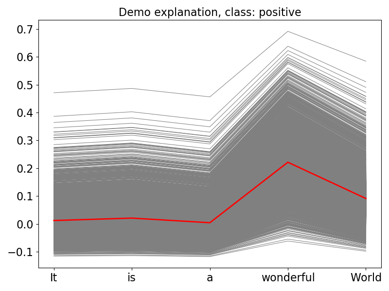
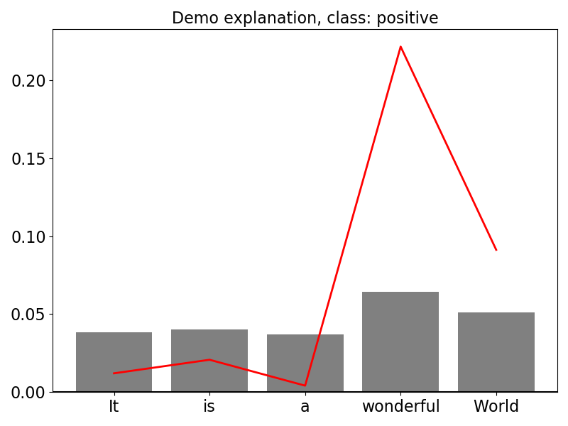
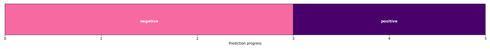
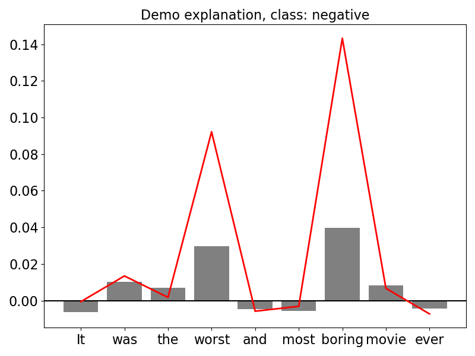

# RME 

[](https://travis-ci.org/kobylkam/RME)
[](https://codecov.io/gh/kobylkam/RME)

Overview
---------------

Recurrent Memory Explainer (RME) is a tool for creating interpretable explanations, dedicated to models operating on sequential data. RME focuses on the memory of a sequential model and tries to explain the decision by pointing important places in the sequence that had an effect on the prediction. RME is based on so-called „memory profiles”, which are intuitive and can be easily visualised on simple plot charts.

Installation
---------------

RME can be istalled directly from github using pip:

<pre>
pip install git+https://github.com/kobylkam/RME
</pre>

Demo
---------------

A machine learning model predicting the sentiment of the sentence (whether it is positive or negative) serves as an example of RME demo explanations. Full code of an example can be found in [notebooks](https://github.com/kobylkam/RME/blob/master/notebooks/Demo_RME.ipynb) folder.

### 1. Creating an explainer 

At the beginning, we create an explainer and pass the whole dataset to construct a vocabulary. The vocabulary is going to be used to construct perturbations of the instance being explained.

```{python}
from RME import explainer.Explainer

e = Explainer(train_set=data)
```

### 2. Explaining instance

We are interested in explaining the following instance: *It is a wonderful World!*. We need to pass model's ``predict_proba`` function, which outputs classes' probabilities and supply the class we are interested (0 - negative / 1 - positive). 

```{python}
e.explain_instance(instance = ['What a wonderful World!'], predict_function = predict_function, class_index=1)
```

We can also calculate step-by-step prediction to see how the prediction changed after each word.

```{python}
e.explain_instance(instance = ['What a wonderful World!'], predict_function = predict_function, class_index=1)
```

### 3. Visualization

After explaining the instance, the module is ready to visualize obtained results. 

```{python}
e.plot_local_perturbations(type='probability_change', title = 'Demo explanation, class: positive')
```


```{python}
e.plot_local_perturbations(type='probability_change', title = 'Demo explanation, class: positive')
```


```{python}
e.plot_local_perturbations(type='probability_change', title = 'Demo explanation, class: positive')
```


Once the explainer is constructed, it can serve for various instances. Below, the RME visualizes the impact of the following words on negative sentiment prediction for the sentence: *It was the worst and most boring movie I have ever seen*.

```{python}
e.explain_instance(instance=['It was the worst movie I have ever seen!'],predict_function=predict_function,class_index=0)
e.plot_local_perturbations(type='probability_change', title = 'Demo explanation, class: positive')
```




Documentation
---------------

For all the features the package offers, see the [documentation](https://kobylkam.github.io/RME/documentation/).

The package was created as a part of master's diploma thesis at Warsaw University of Technology at Faculty of Mathematics and Information Science by Mateusz Kobyłka.
